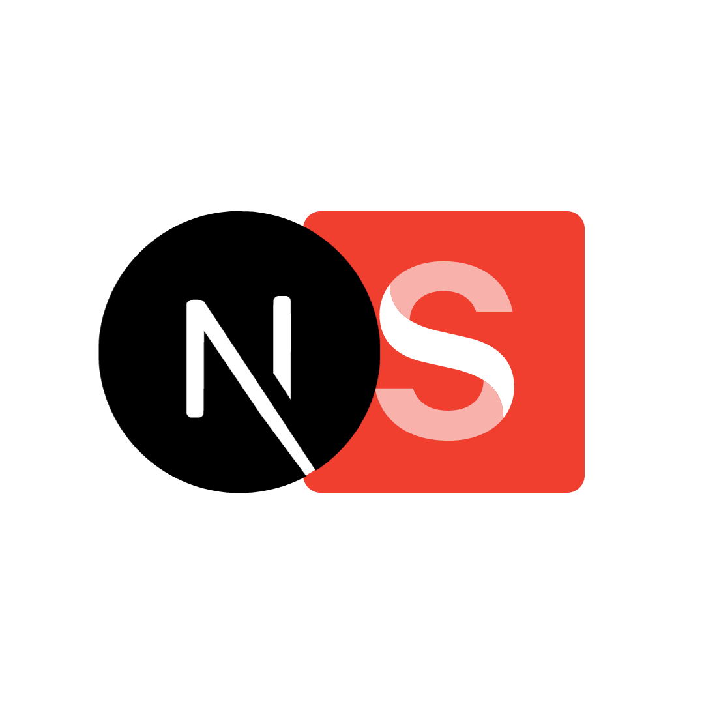

<div align="center">
  
  <h1>Sanity.io + NextJS Portfolio Site</h1>
  <p>A portfolio template built with <a href="https://nextjs.org">Next.js</a>, <a href="https://tailwindcss.com">Tailwind CSS</a> and <a href="https://sanity.io">Sanity.io</a> for content</p>
</div>

To use this as a template for your portfolio site, follow this guide: [How to build a Portfolio Site with Sanity and Next.js][freecodecamp-guide] to learn how to set-up your Sanity account and connect the schema data. Every content of this repo relies on it that guide.

## Features

- A performant, static personal website with editable projects
- Manage portfolio content through sanity content lake by visiting `yourwebsite.com/studio`
- Webhook-triggered continuous deployment; Content updates will automatically trigger a build command
- Built with cutting-edge technologies: Next.js 13, TypeScript, Tailwind CSS

## Project Overview

| [Personal Website][site]          | [Studio][studio]                 |
| --------------------------------- | -------------------------------- |
| ![Personal Website][site-preview] | ![Sanity Studio][studio-preview] |

### Important files and folders

| File(s)                                                   | Description                                     |
| --------------------------------------------------------- | ----------------------------------------------- |
| [`sanity.config.ts`](sanity.config.ts)                    | Config file for Sanity Studio                   |
| [`sanity.client.ts`](sanity/sanity.client.ts)             | Config file for Sanity CLI                      |
| [`studio`](<./app/(studio)/studio/[[...index]]/page.tsx>) | Where Sanity Studio is mounted                  |
| [`schemas`](./schemas)                                    | Where Sanity Studio gets its content types from |
| [`sanity.query.ts`](./sanity/sanity.query.ts)             | Where Sanity data is described and retrieved    |

## Run project locally

```bash
git clone https://github.com/rodolfostark/portfolio

cd portfolio

npm install

npm run dev
```

Visit [http://localhost:3000][localhost-3000] to see your site
Visit [http://localhost:3000/studio][localhost-3000-studio] to edit content

## Next steps

- [How to query content?][sanity-groq]
- [Sanity + NextJS Blog Template][other-templates]

<!-- LINK VARIABLES -->
[site]: https://sanity-nextjs-site.vercel.app
[studio]: https://sanity-nextjs-site.vercel.app/studio
[site-preview]: https://user-images.githubusercontent.com/6951139/206395107-e58a796d-13a9-400a-94b6-31cb5df054ab.png
[studio-preview]: https://user-images.githubusercontent.com/6951139/206395521-8a5f103d-4a0c-4da8-aff5-d2a1961fb2c0.png
[sanity-groq]: https://www.sanity.io/docs/how-queries-work?utm_source=github.com&utm_medium=referral&utm_campaign=nextjs-v3vercelstarter
[localhost-3000]: http://localhost:3000
[localhost-3000-studio]: http://localhost:3000/studio
[freecodecamp-guide]: https://www.freecodecamp.org/news/how-to-build-a-portfolio-site-with-sanity-and-nextjs
[other-templates]: https://github.com/sanity-io/sanity-template-nextjs-appdir-personal-website
